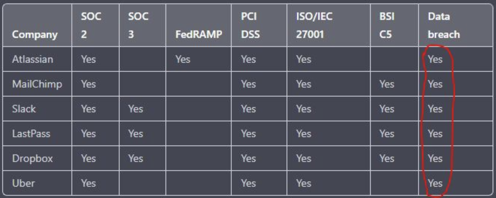

# Continuous Compliance & Lula

---

# Introduction
- Compliance Vs Security
- Authority to Operate
- Continuous Authority to Operate
- How do we get there?
- Lula
- Demo

<!--
- Demo prepared - wanted to "set the stage" 
-->

---
<!-- _footer: https://ventureinsecurity.net/p/the-importance-of-adopting-a-security -->
# Compliance Vs Security

<!--
- The intent of implementing compliance requirements is to promote security.
-->

---

# Authority to Operate
- Period review against a snapshot of the system
- Often a "check-box" activity
- Little re-usable components are available
    - Everyone is duplicating work for common components

<!-- 
- The problem here has many nuances - but some common denominators are that the ATO process is both a fixed point in time on the initial system and approved against a product instead of process
-->

---

# cATO

- Seeks approval for process instead of product
- More agile to deliver updates and ultimately request/prove ATO
- Continuous Compliance
    - CI/CD processes that prove 

<!-- 
- Whether you prescribe to the existence of the cATO or not - the underlying concept for seeking approval of processes in place of product moves us into a realm of continuous compliance
- We need the ability to deliver updates that both pre-declare control satisfaction as well as provide data to ensure it satisfies the control throughout its lifetime.
-->

---
<!--_footer: 1. Governance, Risk, Compliance-->
# How do we get there?
- Re-usable Components
    - OSCAL models
- Pre-runtime Validation
- Event-driven runtime Validation
    - Integration with GRC tooling[1]
    - Live Visualization
<!--

-->

---

# Lula
- Open Source Project
    - https://github.com/defenseunicorns/lula
- Static manifest and Runtime validation of control satisfaction    
- Collaboration with NIST to drive enhancements to OSCAL
    - Promote adoption of OSCAL through incremental automated and non-automated process artifacts

<!--

-->

--- 

# Demo
